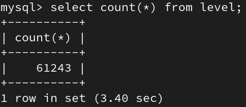

# Práctica 1

## Diagrama Entidad Relacion

## Diagrama Lógico

## Counts de Tablas
- status

- currency

- locations

- countrycodes

- geoname

- project

- transaction

- level

## Queries

1. ¿Cuántos proyectos iniciaron en el 2011?

2. ¿Cuál fue el proyecto de mayor duración?

3. ¿Cuál fue el proyecto de menor duración?

4. Top 5 de países con más proyectos asignados

5. Top 5 de países con menos proyectos asignados

6. ¿Cuál fue el proyecto con más costo?

7. ¿Cuál fue el proyecto menos costoso?

8. Top 5 de proyectos más costosos

9. Costo Total de Todos los Proyectos

10. Top 3 de las Transacciones más Costosas RI-East Africa Public Health Laboratory Networking Project

